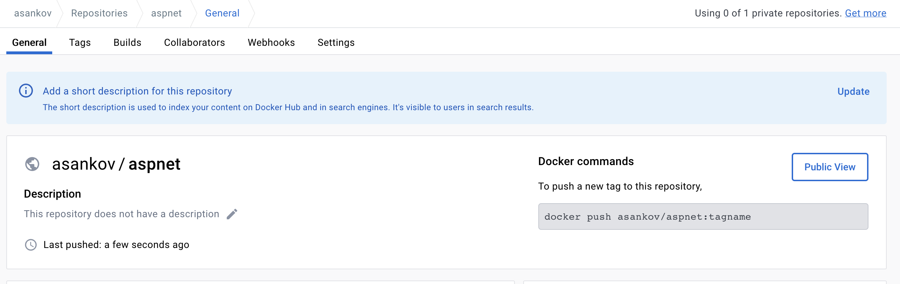

# Intro to Containers

Code demos for the **Intro to Containers** presentation.

The demos are based on the [aspnet-mysql](https://github.com/docker/awesome-compose/tree/master/aspnet-mssql) application from [this repo](https://github.com/docker/awesome-compose).

To learn more about Containers check out the [slides](./intro-to-containers.key).

## Build and run the container

To build and run the application in this repo:

1. [Download and Install Docker Desktop](https://www.docker.com/products/docker-desktop/)

2. Build the containers

    ```shell
    # go to the app folder
    $ cd app

    # build the container
    $ docker build -t aspnet .

    # run the container
    $ docker run -p 80:80 aspnet
    ```

    The `-t aspnet` option tags the image with the `aspnet` tag.
    This way we are naming the image, so that we can use it later.

    The `-p 80:80` option maps the local port 80 to port 80 in the container.

## Push the container to a registry

To build the container to a registry (for example, [Docker Hub](https://hub.docker.com/)):

1. Go to [Docker Hub](https://hub.docker.com/) and create an account.

2. Build the image again, but this time prefix the tag with your username:

    ```shell
    # go to the app folder
    $ cd app

    # build the container and tag it with your username
    docker build -t <username>/aspnet .

    # push the container via its tag
    docker push <username>/aspnet
    ```

3. Login to Docker Hub with your username and password:

    ```shell
    $ docker login --username <username>
    Password: <enter_password>
    ```

4. Push the image:

    ```shell
    docker push <username>/aspnet
    ```

5. The image should now be visible in your Docker Hub account


